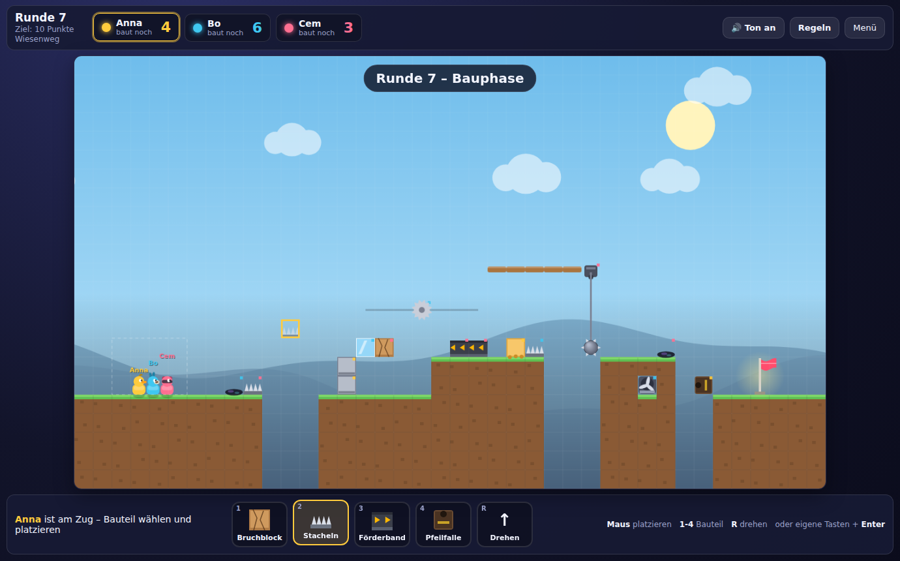

# Ultimate Duck Mule

Ein Party-Plattformer im Stil von *Ultimate Chicken Horse* für **2 bis 3 Spieler** –
gebaut ausschließlich mit **PHP, HTML, JavaScript und CSS**. Kein Build-Schritt,
keine Abhängigkeiten, keine externen Assets: Grafik und Sound werden zur Laufzeit
gezeichnet bzw. synthetisiert.



## Worum geht es?

Jede Runde besteht aus zwei Phasen:

1. **Bauphase** – Der Reihe nach setzt jeder Spieler genau *ein* Bauteil aus seiner
   Hand ins Level. Die Bauteile bleiben das ganze Match liegen, das Level wird also
   Runde für Runde gemeiner.
2. **Partyphase** – Alle starten gleichzeitig und versuchen, die Fahne zu erreichen.
   Wer stirbt, schaut den Rest der Runde zu.

### Punkte

| Ereignis | Punkte |
| --- | --- |
| Ziel erreicht | **+1** |
| Einziger im Ziel | **+2** zusätzlich |
| Ein Gegner stirbt an einem deiner Bauteile | **+1** pro Opfer |
| Du stirbst an deinem eigenen Bauteil | **−1** |

Unter 0 Punkte geht es nicht. Wer nach einer Runde die Zielpunktzahl (Standard: 10)
erreicht hat **und allein vorne liegt**, gewinnt das Match – bei Gleichstand geht es
weiter.

## Starten

Es genügt PHP 8.1 oder neuer:

```bash
php -S localhost:8000
```

Dann `http://localhost:8000/` im Browser öffnen. Alternativ das Verzeichnis auf
einen beliebigen Webspace mit PHP legen – für den lokalen Modus reicht sogar
reines Ausliefern der Dateien, für den Online-Modus wird PHP gebraucht.

Damit der Online-Modus funktioniert, muss `data/rooms/` für den Webserver
beschreibbar sein (dort liegt pro Raum eine JSON-Datei).

### Wenn der Server `404 ... - No such file or directory` meldet

Dann steht der Server im falschen Verzeichnis. `php -S` liefert nur Dateien
aus dem Ordner aus, in dem er gestartet wurde – Rootrechte ändern daran
nichts, `sudo` wird hier nicht gebraucht.

```bash
git clone https://github.com/BeLeBo/ultimate-duck-mule.git
cd ultimate-duck-mule
ls index.php          # muss "index.php" ausgeben, sonst stimmt der Ordner nicht
php -S localhost:8000
```

Beim Start schreibt PHP die Zeile `Document root is ...` ins Terminal – dort
muss genau der Ordner stehen, in dem `index.php` liegt. Stimmt er, gibt es
beim Aufruf von `http://localhost:8000/` **keine** 404-Zeilen mehr.

Unter Windows funktioniert derselbe Befehl in der Eingabeaufforderung. Wer
dort kein PHP installiert hat, kann stattdessen XAMPP nehmen und den Ordner
nach `C:\xampp\htdocs\` kopieren; das Spiel liegt dann unter
`http://localhost/ultimate-duck-mule/`.

## Spielmodi

### Lokal an einer Tastatur

2 oder 3 Spieler, jeder mit eigenem Tastenblock:

| Spieler | Laufen | Springen | Runter |
| --- | --- | --- | --- |
| 1 | `A` / `D` | `W` | `S` |
| 2 | `←` / `→` | `↑` | `↓` |
| 3 | `J` / `L` | `I` | `K` |

In der Bauphase platziert der Spieler, der am Zug ist, sein Bauteil mit der **Maus**
(`1`–`4` wählt das Bauteil, `R` dreht es). Wer keine Maus benutzen will, bewegt den
Bauzeiger mit den eigenen Laufen-/Springen-Tasten und platziert mit `Enter`.

### Online mit Raumcode

Ein Spieler erstellt einen Raum und gibt den vierstelligen Code weiter; bis zu drei
Spieler können beitreten. Die Steuerung ist dann `A`/`D` **oder** die Pfeiltasten.

Aufteilung der Verantwortung:

* **Server (PHP)** ist die Wahrheit für alles Diskrete: Phasen, Zugreihenfolge,
  gesetzte Bauteile, Rundenergebnisse und Punktestand.
* **Client (JavaScript)** rechnet die Physik der eigenen Figur und meldet nur das
  Ergebnis („im Ziel“ / „gestorben an Bauteil von Spieler X“) zurück. Die anderen
  Figuren werden aus den Serverpositionen interpoliert.

Synchronisiert wird per Polling (~11×/s in der Partyphase, 1×/s sonst) – ohne
WebSockets, weil außer PHP nichts erlaubt ist. Für drei Spieler im LAN oder auf
einem normalen Webspace reicht das.

## Bauteile

| Bauteil | Wirkung |
| --- | --- |
| Steinblock | Solide und zuverlässig |
| Eisblock | Solide, aber spiegelglatt |
| Sprungblock | Katapultiert alles, was darauf landet |
| Bruchblock | Bricht 0,45 s nach der Berührung weg |
| Wolke | Einweg-Plattform, von unten durchspringbar (mit `↓` fällt man durch) |
| Förderband | Schiebt in Pfeilrichtung (drehbar) |
| Klebeblock | Bremst stark, Wände lassen sich beklettern |
| Leiter | Zum Hochklettern (Sprungtaste), nicht solide |
| Ventilator | Luftstrom über 5 Felder (drehbar) |
| Stacheln | Tödlich, zeigen in die gewählte Richtung (drehbar) |
| Kreissäge | Pendelt tödlich entlang ihrer Schiene (drehbar) |
| Pfeilfalle | Schießt alle 1,7 s einen Pfeil (drehbar) |

Jedes gesetzte Bauteil trägt in der Ecke einen kleinen Punkt in der Farbe seines
Besitzers – wichtig, weil Kills den Bauteil-Besitzer belohnen.

## Bewegung

Laufen mit Beschleunigung und Reibung, variable Sprunghöhe (Taste früher loslassen
= niedriger springen), Coyote-Time und Sprungpuffer für zuverlässige Kantensprünge,
Wandrutschen und **Wandsprung**, Leitern und kletterbare Klebewände.

## Selbsttest

`tests.php` im Browser öffnen. Die Seite fährt 27 Tests gegen die echte
Spiel-Engine: Sprunghöhen, jedes Bauteil, jede Todesursache, ein kompletter
automatischer Durchlauf bis zur Fahne – und sie vergleicht die Bauregeln und den
Bauteil-Katalog von JavaScript **mit denen von PHP**, damit Server und Client nicht
auseinanderlaufen.

## Projektstruktur

```
index.php              Menü: lokales Spiel einrichten, Raum erstellen/beitreten
game.php               Spielseite; liefert Level- und Kartendaten als JSON an den Client
tests.php              Selbsttest-Seite (Physik + Abgleich PHP/JavaScript)
api/index.php          JSON-Schnittstelle für den Online-Modus
lib/Cards.php          Katalog der Bauteile (Namen, Gewichte, Drehbarkeit)
lib/Levels.php         Level-Geometrie und Bauregeln – einzige Quelle für beide Seiten
lib/Game.php           Spielregeln des Online-Modus: Phasen, Zugfolge, Punkte
lib/Rooms.php          Raumdateien mit Dateisperre, Aufräumen alter Räume
lib/View.php           Kleine HTML-Helfer (eingebettetes Tab-Symbol)
assets/js/core.js      Konstanten, Mathe-Helfer, synthetischer Sound
assets/js/level.js     Kachelgitter, Bauteil-Physik, bewegliche Gefahren
assets/js/player.js    Steuerung und Plattformer-Physik der Figur
assets/js/render.js    Komplettes Zeichnen auf die Canvas
assets/js/input.js     Tastatur und Maus, drei Tastenbelegungen
assets/js/net.js       Polling-Transport für den Online-Modus
assets/js/game.js      Phasenmaschine, HUD, Spielschleife
data/rooms/            Laufzeitdaten der Online-Räume (wird ignoriert von git)
```

## Bewusste Abweichungen vom Original

* **Gebaut wird der Reihe nach**, nicht gleichzeitig. An einer gemeinsamen Tastatur
  geht es gar nicht anders, und online bleibt die Reihenfolge damit eindeutig.
* **Figuren kollidieren nicht miteinander** – sie laufen durcheinander hindurch.
* Online ist die Physik **clientseitig**: Wer das Spiel manipulieren will, kann das.
  Für eine Runde mit Freunden ist das kein Problem, für ein Turnier schon.
* Die Punktetabelle ist eine eigene, vereinfachte Variante (siehe oben).
